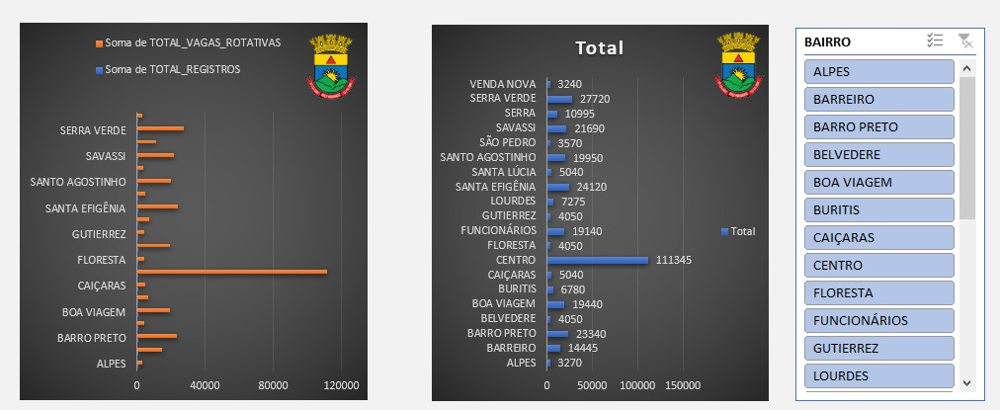
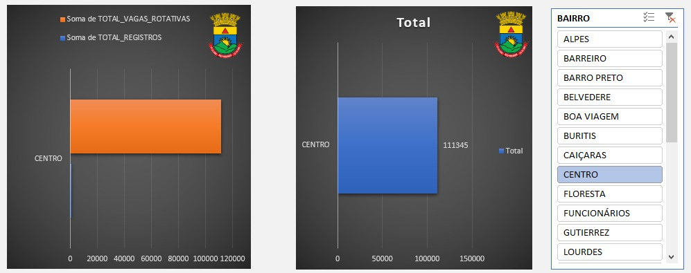
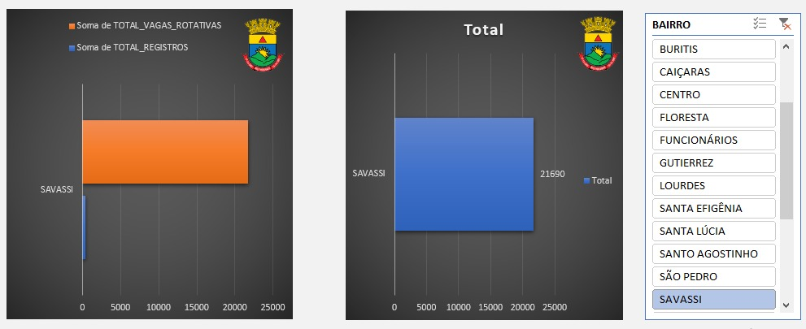
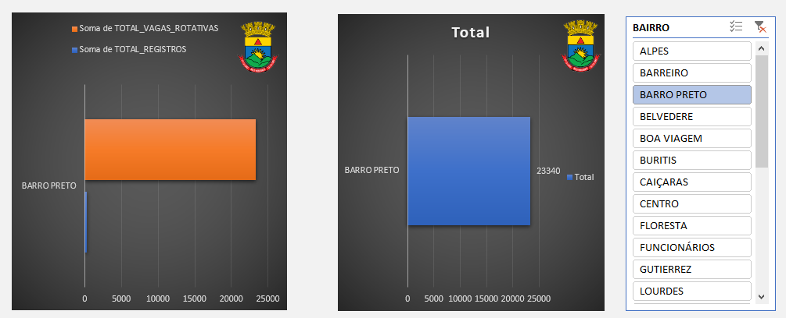
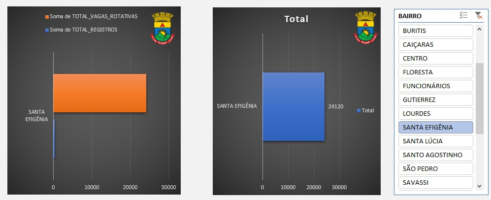
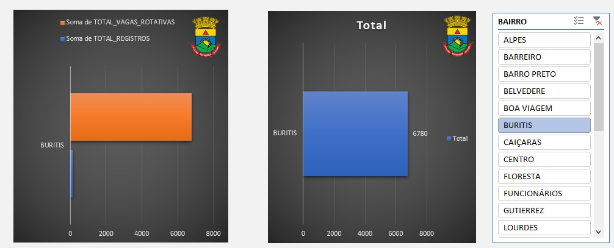
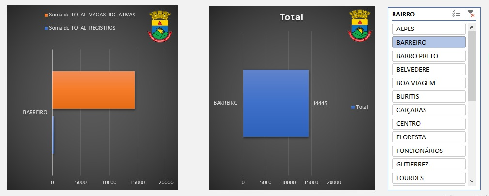
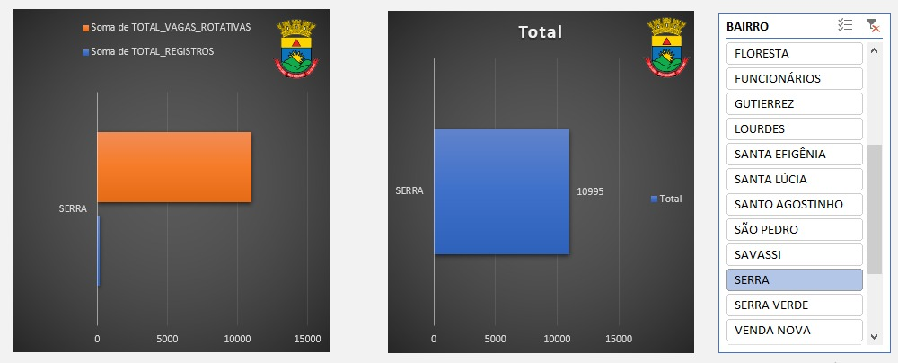

🏙️ Dashboard de Mobilidade Urbana: Estacionamento Rotativo BH

📝 Sobre o Projeto
Este projeto analisa o sistema de estacionamento rotativo em Belo Horizonte, transformando dados brutos da prefeitura em um Dashboard interativo. O painel permite monitorar a oferta de vagas versus a demanda real de registros por região.

📊 Análise por Localidade (Insights do Dashboard)
Utilizando a segmentação de dados, o dashboard fornece visões específicas para cada polo comercial da cidade:

🌍 Visão Geral do Sistema
Status Global: O sistema conta com um total de 338.550 vagas rotativas disponíveis na rede.

Distribuição: A visualização geral mostra que a oferta está fortemente concentrada na região central, decrescendo em direção aos bairros periféricos.

📍 Análise por Bairros
Abaixo, os destaques operacionais das principais regiões monitoradas:




Centro: É o coração do sistema, possuindo a maior densidade com 111.345 vagas rotativas. É o ponto de maior rotatividade e volume de registros da capital.




Savassi: Um polo comercial e de lazer crítico, onde a demanda por registros é constante, exigindo monitoramento rigoroso das vagas existentes.



Barro Preto: Conhecido pelo polo têxtil, apresenta um volume significativo de 23.340 vagas, essencial para o fluxo de compradores e lojistas.



Santa Efigênia: Região hospitalar com alta necessidade de giro de vagas; o dashboard aponta uma oferta de 24.120 vagas para atender ao fluxo de pacientes e profissionais.



Buritis & Barreiro: Representam polos de descentralização, com o Barreiro registrando 14.445 vagas, mostrando a expansão do sistema para as áreas regionais.







Serra: Apresenta uma ocupação mais residencial/comercial leve, com 10.995 vagas rotativas mapeadas no painel.



🛠️ Desafios Técnicos Superados
Integração Dinâmica: Solução do erro de referência de intervalo para permitir que formas geométricas exibam valores em tempo real provenientes de Tabelas Dinâmicas.

Conexão de Relatórios: Sincronização de múltiplos gráficos (barras e colunas) sob um único filtro de Bairro, garantindo integridade visual e técnica.

```
📂 Estrutura de Arquivos
Plaintext
├── assets/          # Imagens dos bairros e indicadores (png, svg)
├── data/            # Base de dados bruta (tb_estacionamento)
├── README.md        # Documentação detalhada
└── Dashboard_BH.xlsx # Arquivo final do projeto
```